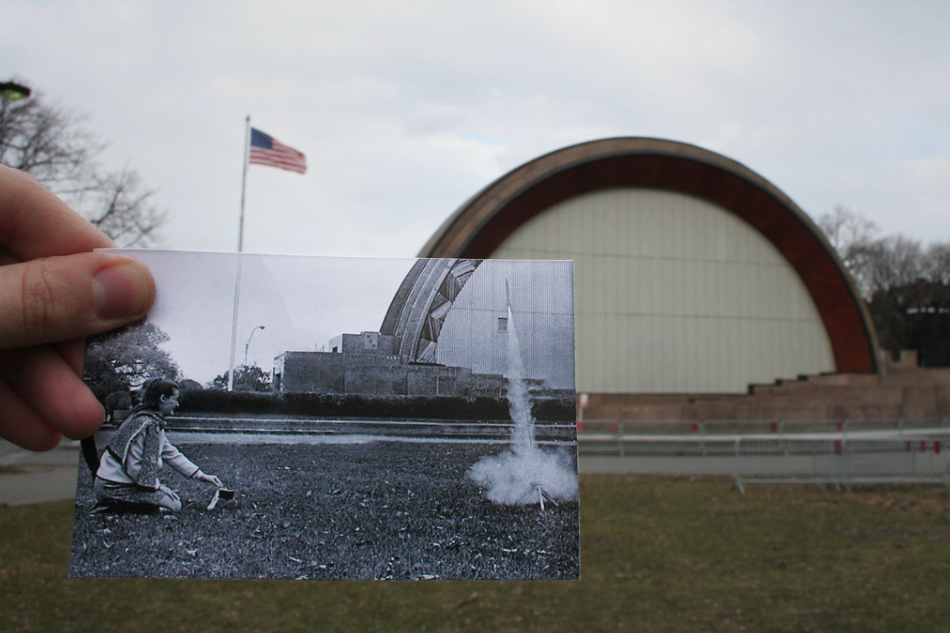
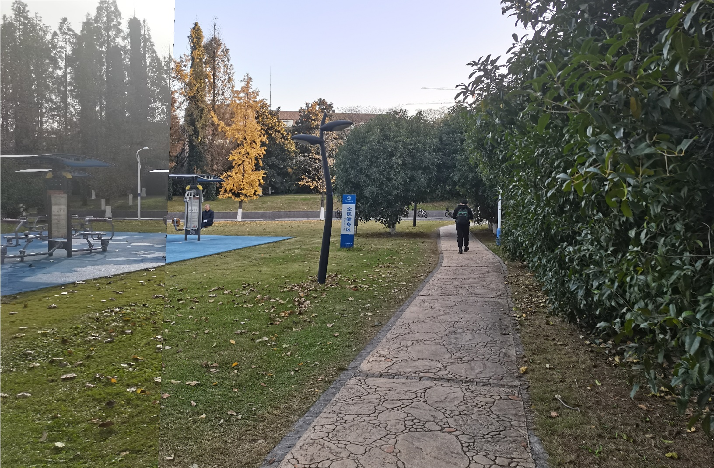
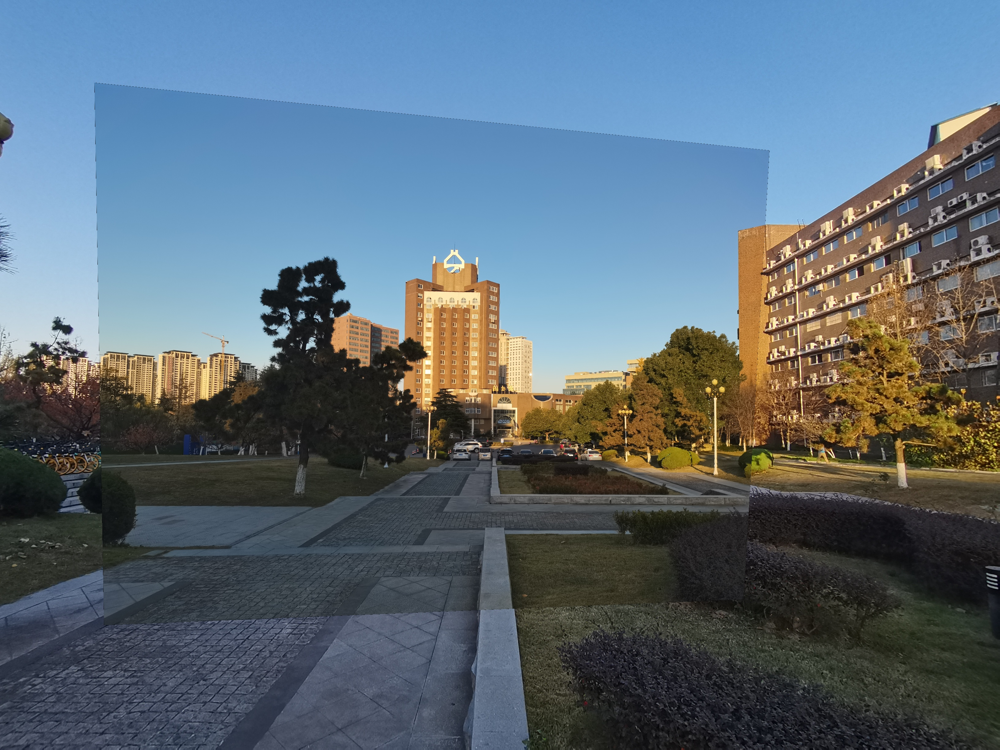

[](https://classroom.github.com/online_ide?assignment_repo_id=6409816&assignment_repo_type=AssignmentRepo)

# Welcome To The Homepage of WTD&MKD's project

### 成员及分工

- 王腾达（PB18051016）
  * 设计，coding

- 梅康迪（PB18081646）
  * 调研，改进，摸鱼，写报告

# 问题描述

- ### 初衷和动机

​			该项目题为“**Look into past**"。从时间角度来看，事物是不断变化的，而在同一个时间点处事物的过去与现在是不可能同时出现的。然而，如果我们在当前环境下看到事物过去的情景，又会是怎么一种体验？

- ### 创意描述

​			先看一下“**Look into past**"的效果。

​			

​			我们想实现的在白天场景里面嵌入夜晚场景，或者在夜晚场景里面嵌入白天场景，场景白天与黑夜的共存。

- ### 计算机视觉问题

​			“**Look into past**"主要是找到嵌入图片在背景中的位置并将其嵌入背景图中，因此本质上是一个图像拼接问题。

# 原理分析

​	要实现图像拼接，简单来说需要以下几步：

1. 对每幅图进行特征点提取
2. 对特征点进行匹配
3. 进行图像配准
4. 把图像拷贝到背景图像的特定位置
5. 对重叠边界进行特殊处理，进行图像融合


​	在上述步骤中，利用SIFT算法提取图像特征进而进行特征匹配，继而使用RANSAC算法对特征匹配的结果进行优化，接着利用图像变换结构进行图像映射，最终进行图像融合。


​	SIFT算法实现特征匹配主要有以下三个流程：

1. **提取关键点**：关键点是一些十分突出的不会因光照、尺度、旋转等因素而消失的点，比如角点、边缘点、暗区域的亮点以及亮区域的暗点。此步骤是搜索所有尺度空间上的图像位置。通过高斯微分函数来识别潜在的具有尺度和旋转不变的兴趣点。
2. **定位关键点并确定特征方向：**在每个候选的位置上，通过一个拟合精细的模型来确定位置和尺度。关键点的选择依据于它们的稳定程度。然后基于图像局部的梯度方向，分配给每个关键点位置一个或多个方向。所有后面的对图像数据的操作都相对于关键点的方向、尺度和位置进行变换，从而提供对于这些变换的不变性。
3. **通过各关键点的特征向量**，进行两两比较找出相互匹配的若干对特征点，建立景物间的对应关系。


​	RANSAC通过反复选择数据中的一组随机子集来达成目标。被选取的子集被假设为局内点，并用下述方法进行验证：

1. 首先我们先随机假设一小组局内点为初始值。然后用此局内点拟合一个模型，此模型适应于假设的局内点，所有的未知参数都能从假设的局内点计算得出。
2. 用1中得到的模型去测试所有的其它数据，如果某个点适用于估计的模型，认为它也是局内点，将局内点扩充。
3. 如果有足够多的点被归类为假设的局内点，那么估计的模型就足够合理。
4. 然后，用所有假设的局内点去重新估计模型，因为此模型仅仅是在初始的假设的局内点估计的，后续有扩充后，需要更新。
5. 最后，通过估计局内点与模型的错误率来评估模型。	

​	整个这个过程为迭代一次，此过程被重复执行固定的次数，每次产生的模型有两个结局：要么因为局内点太少，还不如上一次的模型，而被舍弃；要么因为比现有的模型更好而被选用。


​	总的来讲，在图像拼接过程中，运用SIFT局部描述算子检测图像中的关键点和特征，SIFT特征是基于物体上的一些局部外观的兴趣点而与影像的大小和旋转无关。对于光线、噪声、些微视角改变的容忍度也相当高，所以用来检测要拼接图像的特征及关键点就很有优势。而接下来即步骤三是找到重叠的图片部分，连接所有图片之后就可以形成一个基本的全景图了。匹配图片最常用的方式是采用RANSAC算法，用此排除掉不符合大部分几何变换的匹配。之后利用这些匹配的点来估算变换矩阵，也就是将其中一张图像通过关联性和另一张匹配。

# 代码实现

​		根据原理分析中的步骤，依次实现如下功能：

- #### 进行特征点提取

  `detetctAndDescribe(image)` 函数中调用`cv2.xfeatures2d.SIFT_creare()`，即调用SIFT算法来获取SIFT特征点，并计算描述子。

- #### 对特征点进行匹配

  `matchKeypoints`函数中首先调用cv2.BFMatcher()建立暴力匹配器；然后使用KNN检测两图中的SIFT特征匹配对（K=2）；接着根据最近距离跟次进距离的比值小于设定的阈值`ratio`来保留匹配对，从而进行特征筛选；最后根据筛选后的特征获取匹配点坐标，并调用`cv2.findHomography`来利用RANSAC算法计算视角变换矩阵。

- #### 进行图像配准

  在`stitch()`函数中调用`cv2.warpPerspective()`函数，利用上一步中得到的视角变换矩阵，得到视角变换后的结果，其中视角变换所得的结果包括图像位置、图像视角变换。

- #### 把图像拷贝到背景图像的特定位置

  `mix_pic()`函数中直接将视角变换后的矩阵复制到背景图中。

  ```dart
  def mix_pic(src,dst):#src是拼入图，dst是背景
      for i in range(dst.shape[0]):
          for j in range(dst.shape[1]):
              p=src[i][j]
              if( all(p)): 
                  dst[i][j]=src[i][j]
      return dst
  ```

  

# 效果展示

- #### test1

  

  


- #### test2

  

  


# 工程结构

```dart
.
|-- code
|    |--main.py    #主函数
|-- input
|    |--test1.jpg  #测试图片1
|    |--test2.jpg  #测试图片2
|-- output
    |--result1.jpg #test1插入结果
    |--Match1.jpg  #test1匹配结果
    |--result2.jpg #test2插入结果
    |--Match2.jpg  #test2匹配结果
```


# 运行说明

​	numpy==1.16.5

​	cv2-python==4.5.4-dev

​	运行main.py即可


