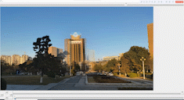

# 基于Tkinter的图片插入器
## ——用以实现look into past
### 一、问题探讨
经过组内成员的探讨和对一些图片的实验，发现现有的代码无法并不能很好地适用于各种图片融合的情况。而某些特殊情况，更是无法通过经典算法解决。有如下几种情况，为了方便说明，我们将背景图设置为老照片（老图），插入图设置为新照片（新图）：

1. 老图不存在建筑且新照片存在建筑（反之亦然），周围景观无法匹配：这种情况无法通过算法解决，因为特征匹配算法无法计算配对。
2. 两图都有某建筑，但周围景观特征点存在大量干扰：这个情况下，周围景观的特征点与图片匹配导致变换矩阵不鲁邦，新图扭曲严重。
3. 建筑成像问题：光照不同导致建筑的颜色，对比度等不同。光照主要来源于太阳光，也可能来自夜晚灯光，影子遮挡等等。这种情况也对像素特征造成巨大影响。
4. 当存在大量类似的建筑时，无法合理匹配，见下面的例子。

* 情况1：在本例中，前方的凉亭虽然可能匹配，但后面拔地而起的摩天大楼无法匹配到合适的位置，整个图片的匹配度太低，难以达成自动匹配的效果。

* 情况2：在本例中，新图的斜塔与老图中的楼房出现了许多匹配，这导致变换矩阵扭曲严重。原因可能是日光照射使得新图的斜塔颜色与老图楼房颜色相近。

* 情况3：在本例中，图书馆受光照影响严重，两张照片拍摄于不同时间段，也有树木和地砖匹配带来的噪声，导致特征匹配失败。

* 而在正常情况下，匹配应该是这样的：

* 情况4：在本例中，四个石像都被对应到了最右边的石像了。

### 二、解决方案

因此在最新的代码中，我们设计了一个基于tkinter的图像编辑器，可以人工把图片插入到背景中。
本编辑器有以下几个功能：
1. 图片拖动：点击图片即可拖动

2. 图片缩放：将鼠标放在图片上滑动滚轮即可

3. 图片旋转：在最上方的滑动条拖动滑块可旋转图片

4. 图片羽化：在最下方的滑条拖动滑块可以羽化图片

5. 图片透视变换：在左下方的按钮可以控制透视变换

本作品无截图功能，建议使用win自带截图工具shift+win+s

以下请欣赏我们的项目成功展示图

* 中科大西区图书馆

* 复活岛石像

* 比萨斜塔

* 也西湖秋冬景

* 也西湖秋冬景2

* 合江亭古今

项目仍在研发中，不代表最终品质，如果您在使用中有疑问请联系作者。

